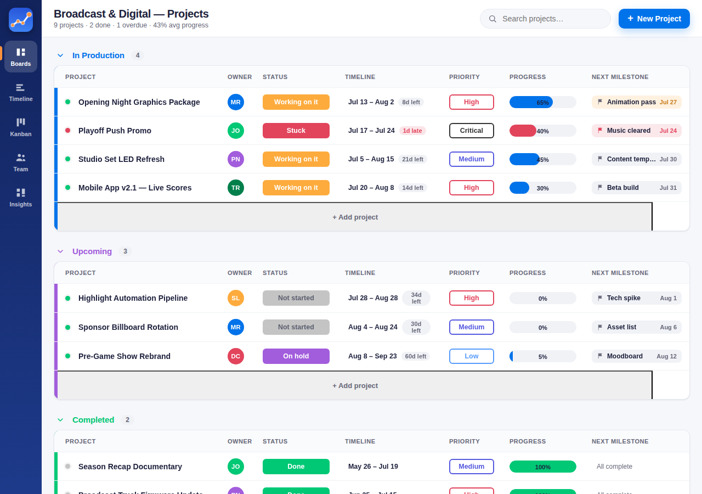

# Line Sweep Pro

A project **scheduling & tracking** app for department managers — assign work to
your team, track status, monitor progress, and set milestone dates. Built with a
[Monday.com](https://monday.com)-style look & feel and smooth, springy motion.

It's a **self-contained Progressive Web App (PWA)**: no build step, no server, no
accounts. It runs by opening a single file, and it **installs on iPhone** (and
Android/desktop) straight from the browser.



---

## Features

**For the manager**
- **Assign** every project to an owner and **group** it (In Production / Upcoming / Completed — fully editable).
- **Track status** with Monday-style color pills — Not started, Working on it, Stuck, On hold, Done.
- **Monitor progress** with animated progress bars; milestones auto-drive the percentage.
- **Set milestone dates** per project, with automatic overdue / due-soon flags.
- **Priority** levels (Low → Critical) with at-a-glance color coding.

**Five views**
| View | What it's for |
|------|----------------|
| **Board** | The Monday-style table — click any cell to edit inline. |
| **Timeline** | A Gantt chart with milestone diamonds, a "today" line, and progress fills. |
| **Kanban** | Drag cards between status columns to update them. |
| **Team** | Per-employee workload: active vs. overdue projects, capacity meter, avg progress. |
| **Insights** | Dashboard — KPIs, status donut, workload chart, and upcoming/overdue milestones. |

**Nice touches**
- **Search** across projects, owners, notes, status, and priority.
- **Overdue & at-risk alerts** surfaced on the board, cards, and dashboard.
- **Milestone celebration** micro-animation when you complete one.
- **Everything is editable** — add/rename team members, rename the board, reset to demo data.
- **Offline-capable** and fully **responsive** (desktop table ↔ mobile cards + bottom tab bar).
- **Data is saved locally** in your browser (`localStorage`) — private to your device.

---

## Run it

### On a computer (fastest)
Just open `index.html` in any modern browser (double-click it). That's it — the app
runs and saves your data locally.

> Note: the *offline service worker* and *installability* only activate over `http(s)`,
> not `file://`. For the full PWA experience (and to install on a phone), serve it — see below.

### Serve locally
```bash
# from the project folder
python3 -m http.server 8080
# then open http://localhost:8080
```

### Install on your iPhone 📱
1. Host the folder somewhere over HTTPS (see **Deploy** below).
2. Open the URL in **Safari** on your iPhone.
3. Tap the **Share** button → **Add to Home Screen**.
4. Launch it from the home-screen icon — it opens full-screen, like a native app, and works offline.

(On Android/Chrome you'll get an **Install app** prompt automatically.)

---

## Deploy (for the iPhone install)

Any static host works, since there's no backend. This repo is already wired for
**GitHub Pages** via a GitHub Actions workflow (`.github/workflows/deploy-pages.yml`)
that redeploys on every push.

**One-time setup** (turns the workflow on):
1. In the repo on GitHub, go to **Settings → Pages**.
2. Under **Build and deployment → Source**, choose **GitHub Actions**.
3. That's it. The next push (or a manual run from the **Actions** tab → *Deploy to GitHub Pages* → *Run workflow*) publishes the site.

Your app goes live at **`https://<user>.github.io/Line-Sweep-Pro/`** — open that in
Safari on your iPhone and **Add to Home Screen**. (All paths are relative, so the
`/Line-Sweep-Pro/` subpath works out of the box.)

Prefer no config? **Netlify** or **Vercel** also work with a drag-and-drop of the folder.

---

## Project structure

```
index.html                 App shell (rail, top bar, view host, mobile tab bar)
manifest.webmanifest       PWA metadata (name, icons, theme)
service-worker.js          Offline caching of the app shell
css/styles.css             Monday-style design system + responsive layout
js/motion.js               Springy micro-interactions (FLIP, pops, staggers, counters)
js/store.js                State, seed data, persistence, and domain logic
js/app.js                  Views, editable cells, drag & drop, modal editor, dashboard
icons/                     App icons (generated)
scripts/make_icons.py      Regenerate the icons (pure Python, no deps)
```

## Tech notes
- **No dependencies, no build.** Plain HTML/CSS/JS with `<script>` tags so it also runs from `file://`.
- **Motion** is built on the Web Animations API and honors `prefers-reduced-motion`.
- **Persistence** is `localStorage` under the key `line-sweep-pro:v1`.
- To start over from the sample board: top-bar menu (☰) → **Reset demo data**.

## Roadmap ideas
- Cloud sync / multi-user (would need a backend + auth).
- Board filtering and sort controls, saved views.
- Recurring projects and dependencies between milestones.
- CSV / calendar (`.ics`) export of milestones.
- Push reminders for upcoming milestone dates.
